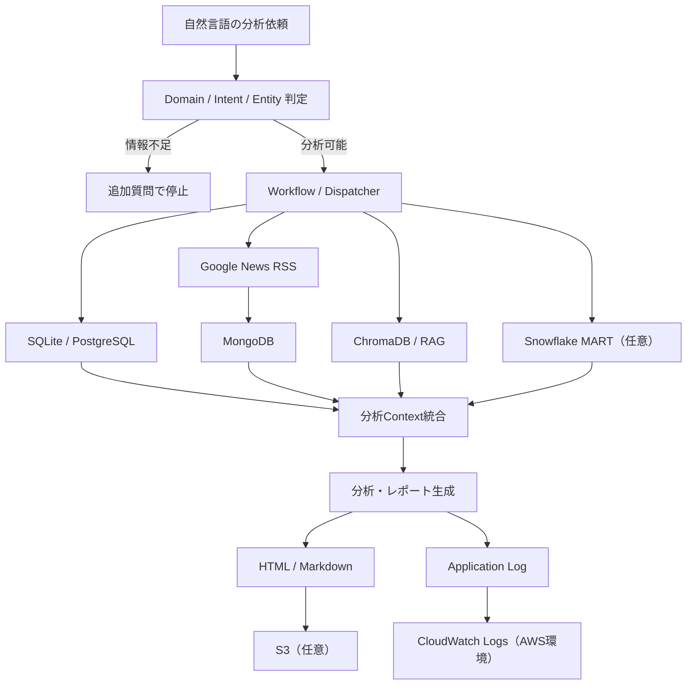

# 株の銘柄分析 AI エージェント

## 1. プロジェクト概要

このリポジトリは、自然言語の株式分析依頼を受け取り、Domain / Intent / Entity を整理したうえで、必要なデータ取得、分析Context統合、HTMLレポート生成までを行うAIエージェント基盤です。情報が不足している場合は、推測で進めず追加質問で停止する設計にしています。

数値データはSQLiteまたはPostgreSQLから取得し、関連文書はChromaDB / RAGで検索します。ニュースはGoogle News RSSから取得し、MongoDBへニュース情報・概要・メタデータを保存します。保存したニュース情報は株価・財務などの数値データとは別Contextで扱います。

Snowflakeは任意の分析用DWHとして追加できます。PostgreSQLを置き換えるものではなく、PostgreSQLの元データをPython同期処理でSnowflake RAWへ登録し、CLEAN / MARTで分析用に整形した結果を既存分析Contextへ別枠で追加します。`SNOWFLAKE_ENABLED=false` の場合、従来のSQLite / PostgreSQL / MongoDB / ChromaDB処理だけを実行します。

生成したHTMLレポートはローカルの `reports/` に保存され、必要に応じてS3へアップロードできます。AWS環境では `logs/agent.log` をCloudWatch Logsへ転送して、実行ログを確認できます。

## 2. デモ成果物

GitHubには、実データベースなしでも確認できるデモ成果物を含めています。

- HTMLレポート: `reports/stock_report_7203.html`
- 録画動画: `reports/toyota_7203_analysis_20260713.mp4`

Windows PowerShellでは、clone後に次のコマンドで開けます。

```powershell
Start-Process ".\reports\stock_report_7203.html"
Start-Process ".\reports\toyota_7203_analysis_20260713.mp4"
```

## 3. 主な機能

- 自然言語による株式分析依頼の受付
- Domain / Intent / Entity の分類
- 銘柄名・銘柄コードの解決
- 情報不足時の追加質問と安全停止
- Workflow / Dispatcher による処理経路の選択
- SQLite / PostgreSQLからの株価・財務・マクロデータ取得
- 相関、回帰、VIF、標準化回帰、簡易予測モデル比較
- Google News RSSによる関連ニュース取得
- MongoDBへのニュース保存とURL単位の重複防止
- ChromaDBを利用したRAG文書検索
- HTML / Markdownレポート生成
- S3へのレポートアップロード
- CloudWatch Logsへのアプリケーションログ転送
- Snowflake MARTデータの任意追加Context
- unittestによる自動テスト

## 4. システム構成



主な責務:

- `stock_domain_router.py`: 株式関連依頼かどうかの入口判定
- `question_agent.py`: CLI入口、分類、銘柄解決、ログ出力
- `orchestrator.py`: 状態遷移とWorkflow選択
- `dispatcher.py`: 選択されたWorkflowの実行
- `analysis_connector.py`: RDB、RAG、ニュース、レポート生成の接続
- `snowflake_connection.py`: Snowflake接続処理
- `snowflake_repository.py`: Snowflake RAW登録・MART取得
- `sync_postgres_to_snowflake.py`: PostgreSQLからSnowflake RAWへの銘柄単位同期
- `generate_stock_report.py`: HTML / Markdownレポート生成
- `mongodb_news_repository.py`: MongoDBへのニュース保存・取得
- `build_chroma_db.py`: RAG文書のChromaDB登録
- `update_market_data.py`: 株価・財務・市場データ更新

## 5. 使用技術

- Python
- SQLite
- PostgreSQL
- MongoDB
- ChromaDB
- pandas
- scikit-learn
- statsmodels
- XGBoost
- Google News RSS
- AWS EC2
- AWS RDS
- AWS S3
- Amazon CloudWatch Logs
- Snowflake
- unittest

## 6. ディレクトリ構成

```text
scripts/        CLI、オーケストレーション、分析、更新処理
tests/          unittestベースの自動テスト
docs/           詳細手順、診断メモ、AWS関連ドキュメント
database/       PostgreSQL移行・再構築関連
rag_documents/  ChromaDBへ登録するMarkdown / TXT文書
data/           ローカルDB・CSV入力置き場（Git管理外）
logs/           実行ログ（Git管理外）
reports/        HTML / Markdownレポート、デモ成果物
chroma_db/      ローカルChromaDB本体（Git管理外）
```

GitHubには、個人環境のDB、ログ、仮想環境、ChromaDB本体、接続情報を含めません。

## 7. セットアップ

### Windows PowerShell

```powershell
git clone <repository-url>
cd <repository-directory>
python -m venv .venv
.\.venv\Scripts\python.exe -m pip install --upgrade pip
.\.venv\Scripts\python.exe -m pip install -r requirements.txt
Copy-Item .env.example .env
.\.venv\Scripts\python.exe -m unittest discover -s tests
```

### macOS / Linux

```bash
git clone <repository-url>
cd <repository-directory>
python3 -m venv .venv
./.venv/bin/python -m pip install --upgrade pip
./.venv/bin/python -m pip install -r requirements.txt
cp .env.example .env
./.venv/bin/python -m unittest discover -s tests
```

`.env` には実行環境に合わせたDB接続情報やMongoDB接続情報を設定します。実値はGit管理しません。

## 8. 環境変数

主要な環境変数は `.env.example` を基準にします。実接続情報、RDSエンドポイント、MongoDB URI、パスワードはREADMEやコードへ書かないでください。

```env
# Database
DB_TYPE=sqlite
SQLITE_DB_PATH=./data/market_analysis.db

# PostgreSQL
POSTGRES_HOST=your-rds-endpoint
POSTGRES_PORT=5432
POSTGRES_DB=market_analysis_test
POSTGRES_USER=your-user
POSTGRES_PASSWORD=your-password
POSTGRES_SSLMODE=require

# MongoDB
MONGODB_ENABLED=false
MONGODB_URI=
MONGODB_DATABASE=stock_analysis
MONGODB_NEWS_COLLECTION=news

# News fetch
NEWS_FETCH_ENABLED=false
NEWS_FETCH_LIMIT=5

# Snowflake
SNOWFLAKE_ENABLED=false
SNOWFLAKE_ACCOUNT=
SNOWFLAKE_USER=
SNOWFLAKE_PASSWORD=
SNOWFLAKE_WAREHOUSE=AI_AGENT_WH
SNOWFLAKE_DATABASE=MARKET_ANALYSIS
SNOWFLAKE_SCHEMA=MART
SNOWFLAKE_ROLE=
SNOWFLAKE_ALLOW_ACCOUNTADMIN_SETUP=false

# S3
ENABLE_S3_UPLOAD=false
S3_BUCKET_NAME=
S3_REPORT_PREFIX=reports
```

| 変数 | 役割 |
| --- | --- |
| `DB_TYPE` | `sqlite` または `postgres` を選択します。 |
| `SQLITE_DB_PATH` | SQLite DBのパスです。 |
| `POSTGRES_*` | PostgreSQL / AWS RDS利用時の接続設定です。 |
| `MONGODB_ENABLED` | `true` のときだけMongoDB処理を有効化します。 |
| `MONGODB_URI` | MongoDB接続文字列です。実値は `.env` のみに設定します。 |
| `MONGODB_DATABASE` | MongoDBのデータベース名です。 |
| `MONGODB_NEWS_COLLECTION` | ニュース保存用コレクション名です。 |
| `NEWS_FETCH_ENABLED` | `true` のときだけGoogle News RSSから外部取得します。 |
| `NEWS_FETCH_LIMIT` | 1回のニュース取得件数です。 |
| `ENABLE_S3_UPLOAD` | `true` のときだけ生成HTMLをS3へアップロードします。 |
| `S3_BUCKET_NAME` | S3アップロード先バケット名です。 |
| `S3_REPORT_PREFIX` | S3内の保存プレフィックスです。 |
| `SNOWFLAKE_ENABLED` | `true` のときだけSnowflake MARTを追加取得します。 |
| `SNOWFLAKE_ACCOUNT` | SnowflakeのAccount Identifierです。実値は `.env` のみに設定します。 |
| `SNOWFLAKE_USER` | Snowflake接続ユーザーです。 |
| `SNOWFLAKE_PASSWORD` | Snowflake接続パスワードです。実値は `.env` のみに設定します。 |
| `SNOWFLAKE_WAREHOUSE` | 利用するWarehouseです。 |
| `SNOWFLAKE_DATABASE` | 利用するDatabaseです。 |
| `SNOWFLAKE_SCHEMA` | 接続時の既定Schemaです。MART取得は `MART.STOCK_ANALYSIS` を参照します。 |
| `SNOWFLAKE_ROLE` | 必要最小権限を付与したRoleです。 |
| `SNOWFLAKE_ALLOW_ACCOUNTADMIN_SETUP` | 初期構築時だけ `true` にできます。通常運用では `false` のままにし、`ACCOUNTADMIN` 接続を拒否します。 |

## 9. 実行方法

### 自動テスト

```powershell
.\.venv\Scripts\python.exe -m unittest discover -s tests
```

### 単一銘柄分析

```powershell
.\.venv\Scripts\python.exe .\scripts\question_agent.py "トヨタを分析して" --skip-web-update
```

HTMLレポートは `reports/stock_report_<銘柄コード>.html` に生成されます。

### 市場データ更新

```powershell
.\.venv\Scripts\python.exe .\scripts\update_market_data.py --stock-code 7203
```

### マクロデータ更新

```powershell
.\.venv\Scripts\python.exe .\scripts\update_macro_from_existing.py --source-data .\data\import
```

### ChromaDB再構築

```powershell
.\.venv\Scripts\python.exe .\scripts\build_chroma_db.py
```

詳細は [docs/rag_setup.md](docs/rag_setup.md) を参照してください。

### PostgreSQLからSnowflake RAWへの同期

Snowflake SQLは `sql/snowflake/` 配下の順に実行して、`RAW`、`CLEAN`、`MART` を作成します。同期は銘柄コード単位で行います。

```powershell
.\.venv\Scripts\python.exe .\scripts\sync_postgres_to_snowflake.py --stock-code 9202
```

同期処理はPostgreSQLを読み取り専用で参照し、Snowflakeの `RAW.STOCK_PRICES`、`RAW.FINANCE`、`RAW.MACRO_ECONOMIC` へMERGEします。同じ銘柄を再実行しても、同一キーの重複行を作らない構成です。初期確認では全件同期を避けるため、株価・マクロは直近行数を `--limit` で制御できます。

```powershell
.\.venv\Scripts\python.exe .\scripts\sync_postgres_to_snowflake.py --stock-code 9202 --limit 200
```

## 10. データベース・検索基盤

### 10.1 SQLite / PostgreSQL

数値データは `DB_TYPE` でSQLiteまたはPostgreSQLを切り替えて取得します。SQLiteはローカル実行向け、PostgreSQLはAWS RDSなどの環境向けです。

接続処理は共通接続層を通し、分析経路はSELECT中心です。PostgreSQL利用時にSQLite用の更新スクリプトを自動実行しないようにしています。

PostgreSQL移行・診断の詳細は次を参照してください。

- [database/postgres/README.md](database/postgres/README.md)
- [docs/postgres_connection_diagnostics.md](docs/postgres_connection_diagnostics.md)

### 10.2 MongoDB

Google News RSSから対象銘柄の関連ニュースを取得し、MongoDBへタイトル、URL、出典、公開日時、概要、取得日時などのニュース情報・メタデータを保存します。

同一URLはupsertで更新するため、重複ドキュメントは作成されません。保存したニュースは株価・財務などの数値データとは別Contextで管理し、レポートの「最新ニュース」と、ルールベースの「ニュースから見た注目ポイント」に表示します。

MongoDB処理は `MONGODB_ENABLED`、Google News RSS取得は `NEWS_FETCH_ENABLED` で無効化できます。

### 10.3 ChromaDB / RAG

`rag_documents/` 配下のMarkdown・テキストをChromaDBへ登録し、ユーザー質問に関連する補足文書を検索します。ChromaDB本体である `chroma_db/` は生成物のためGit管理しません。

```powershell
.\.venv\Scripts\python.exe .\scripts\build_chroma_db.py
```

詳細は [docs/rag_setup.md](docs/rag_setup.md) を参照してください。

### 10.4 Snowflake

Snowflakeは分析用DWHとして任意で利用します。元データの正本はPostgreSQL、ニュース本文の正本はMongoDB、意味検索はChromaDBに残します。SnowflakeにはPostgreSQL由来の構造化データを同期し、CLEAN VIEWで型統一と重複排除を行い、MART VIEWでレポート用の集計Contextを提供します。

追加する主なオブジェクト:

- Database: `MARKET_ANALYSIS`
- Warehouse: `AI_AGENT_WH`
- Schema: `RAW`、`CLEAN`、`MART`
- RAWテーブル: `RAW.STOCK_PRICES`、`RAW.FINANCE`、`RAW.MACRO_ECONOMIC`
- CLEAN VIEW: `CLEAN.STOCK_PRICES`、`CLEAN.FINANCE`、`CLEAN.MACRO_ECONOMIC`
- MART VIEW: `MART.STOCK_ANALYSIS`

Snowflake取得に失敗した場合でも、既存のSQLite / PostgreSQL / MongoDB / ChromaDB分析は継続します。失敗内容は警告としてContextへ記録し、レポート本文にはSnowflake章を表示しません。

Warehouseは `AUTO_SUSPEND` を設定し、利用しない時間帯に自動停止させてSnowflakeの計算コストを管理してください。認証情報、Account Identifier、ユーザー名、パスワードは `.env` のみに保存し、Gitへ登録しないでください。

`ACCOUNTADMIN` は初期構築時のみ使用します。通常運用では `SNOWFLAKE_ALLOW_ACCOUNTADMIN_SETUP=false` のまま、`AI_AGENT_ROLE` などの専用最小権限ロールへ移行してください。専用ロールの権限設計と付与は今後の課題です。

## 11. AWS連携

### 11.1 S3

HTMLレポート生成後、環境変数 `ENABLE_S3_UPLOAD` が有効な場合だけ、生成済みHTMLをS3へアップロードします。ローカル環境ではデフォルト無効で、従来どおり `reports/` 配下への保存のみ行います。

EC2などのクラウド環境では、AWSアクセスキーやシークレットキーを `.env` やコードへ追加せず、EC2に付与したIAMロールで認証情報を取得する構成を想定しています。

S3アップロードに失敗した場合でも、分析とローカルHTMLレポート生成は成功扱いのままです。失敗内容は警告として表示されます。

### 11.2 CloudWatch Logs

`scripts/analyze_stock.py` は実行ログを `logs/agent.log` へ出力します。AWS環境ではCloudWatch Agentを使って、このログをCloudWatch Logsへ転送できます。

詳細は [docs/aws/cloudwatch_logging.md](docs/aws/cloudwatch_logging.md) と [config/cloudwatch-agent-example.json](config/cloudwatch-agent-example.json) を参照してください。

## 12. テスト

このプロジェクトは `unittest` で自動テストを実行します。

```powershell
.\.venv\Scripts\python.exe -m unittest discover -s tests
```

テストには、入口フロー、DB接続、レポート生成、ChromaDB登録、MongoDBへのニュース保存、Google News RSS取得、ニュース表示の確認が含まれます。

## 13. 現在の制約

- 実運用DB、ローカルDB、ログ、接続情報はGitHubに含まれません。
- clone直後は実データを使った分析は実行できません。
- デモHTMLと録画動画はDBなしでも確認できます。
- ニュース取得にはネットワーク接続が必要です。
- MongoDB利用には `MONGODB_URI` などの接続設定が必要です。
- LLMを利用したニュース考察は未実装です。
- 現在の「ニュースから見た注目ポイント」はルールベースです。

## 14. 今後の予定

- DBなしで完結するスモークテスト
- CIによる自動テスト
- ニュース取得元の拡張
- LLMを利用したニュース考察
- サンプルDBの追加
- デモレポートの継続的な更新

## 15. ライセンス

このプロジェクトは MIT License で公開しています。詳細は `LICENSE` を参照してください。
