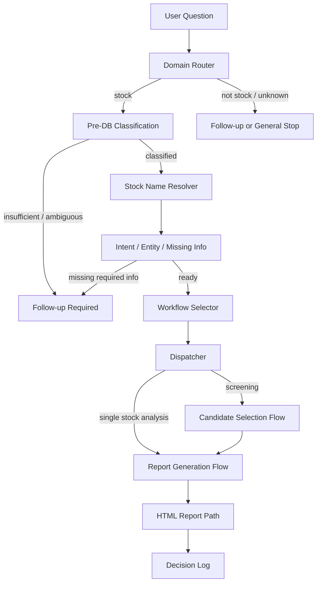

# 株の銘柄分析 AI エージェント

## 1. プロジェクト概要

このリポジトリは、AI エージェントによる株式分析システムの設計・オーケストレーション・分析フローを公開するポートフォリオです。

自然言語の依頼を受け取り、株式関連の依頼かどうかを判定し、Intent / Entity / Missing Information を整理したうえで、適切な Workflow にルーティングします。情報が不足している場合は分析へ進まず、追加質問で停止する設計にしています。

実運用では SQLite の株価・財務・マクロ経済データベースと承認済み VIEW を使い、日本株の銘柄検索、単一銘柄分析、HTML レポート生成を行います。

この公開版では、主に以下の構造を確認できます。

- AI オーケストレーション構造
- Domain / Intent / Entity 処理
- 情報不足時の停止制御
- Workflow / Dispatcher 構造
- State 管理
- 自動テスト

## 2. システム構成図



主要な責務:

- `stock_domain_router.py`: 株式関連依頼かどうかの入口判定
- `question_agent.py`: CLI 入口、分類、銘柄解決、ログ出力
- `orchestrator.py`: 状態遷移と Workflow 選択
- `workflows.py`: Workflow 定義
- `dispatcher.py`: 選択された Workflow の実行
- `generate_stock_report.py`: 既存 DB VIEW から HTML レポートを生成
- `update_market_data.py`: 既存 DB の市場データ更新
- `update_macro_from_existing.py`: CSV 由来のマクロデータ更新

## 3. 主な機能

- 自然言語の株式関連依頼を Domain / Intent / Entity に整理
- 銘柄名・銘柄コードの解決
- 情報不足時の停止ゲート
- 単一銘柄分析 Workflow
- 条件検索から候補銘柄を選び、分析へ進める Workflow
- SQLite VIEW を読み取り専用で参照するレポート生成
- 相関、回帰、VIF、標準化回帰、簡易予測モデル比較を含む分析
- HTML レポートと実行ログの生成
- `unittest` によるオーケストレーション層のテスト

投資助言を目的としたものではなく、AI エージェント設計・分析パイプライン実装のデモです。

## 4. ディレクトリ構成

```text
scripts/   CLI、オーケストレーション、分析、更新処理
tests/     unittest ベースの自動テスト
docs/      設計メモ、既存プロジェクト分析メモ
data/      ローカル DB・CSV 入力置き場
logs/      実行ログ
reports/   HTML / Markdown レポート
sql/       SQL 関連ファイル置き場
```

GitHub には、個人環境の DB、ログ、レポート、仮想環境は含めません。

## 5. セットアップ方法

### Windows PowerShell

```powershell
python -m venv .venv
.\.venv\Scripts\python.exe -m pip install --upgrade pip
.\.venv\Scripts\python.exe -m pip install -r requirements.txt
.\.venv\Scripts\python.exe -m unittest discover -s tests
```

### macOS / Linux

```bash
python3 -m venv .venv
./.venv/bin/python -m pip install --upgrade pip
./.venv/bin/python -m pip install -r requirements.txt
./.venv/bin/python -m unittest discover -s tests
```

## 6. 実行方法

### 自動テスト

clone 直後でも、自動テストは実行できます。

```powershell
.\.venv\Scripts\python.exe -m unittest discover -s tests
```

### 単一銘柄分析

実運用 DB を `data/market_analysis.db` に配置済みの場合のみ、以下のように実行できます。

```powershell
.\.venv\Scripts\python.exe .\scripts\question_agent.py "トヨタを分析して" --skip-web-update
```

HTML レポートは `reports/stock_report_<銘柄コード>.html` に生成されます。

### 市場データ更新

既存 DB がある場合のみ実行できます。

```powershell
.\.venv\Scripts\python.exe .\scripts\update_market_data.py --stock-code 7203
```

### マクロデータ CSV 更新

`scripts/update_macro_from_existing.py` は、既存 CSV を一時作業ディレクトリへコピーしてから既存 importer を実行します。

CSV 入力元の優先順位:

1. `--source-data` CLI 引数
2. 環境変数 `STOCK_MACRO_SOURCE_DATA`
3. リポジトリ相対の `data/import`

```powershell
.\.venv\Scripts\python.exe .\scripts\update_macro_from_existing.py --source-data .\data\import
```

## 7. 現在の制約

本リポジトリには、実運用で使用している株価・財務・マクロ経済データベースは含まれていません。

そのため、clone 直後に実際の株式分析レポートを生成することはできません。

現時点では以下を確認できます。

- AI オーケストレーション構造
- Domain・Intent・Entity 処理
- 情報不足時の停止制御
- Workflow / Dispatcher 構造
- State 管理
- 自動テスト

現在は AI エージェント基盤の設計・実装を公開しています。

データベース初期構築機能、サンプルデータベース、スモークテストについては、今後のバージョンで追加予定です。

実レポート生成に必要な主な VIEW は以下です。

- `v_agent_stock_master`
- `v_agent_data_freshness`
- `v_agent_stock_candidates`
- `v_ai_stock_report_input`
- `v_stock_fundamental`
- `v_macro_economic`

## 8. 今後の予定

- 空の SQLite DB から初期スキーマを作成するスクリプトの追加
- 最小サンプルデータベースの追加
- clone 直後に実行できるスモークテストの追加
- README の実行例とサンプル出力の拡充
- CI によるテスト自動実行
- レポート生成フローのデモ用サンプル HTML の追加

## 9. ライセンス

現時点ではライセンス未設定です。

公開利用を想定する場合は、`LICENSE` ファイルを追加してください。

