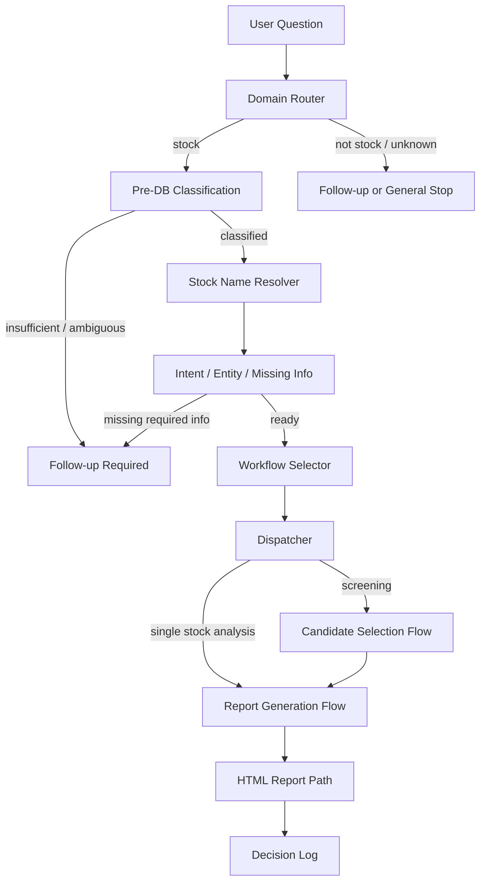

# 株の銘柄分析 AI エージェント

## デモ成果物

初見の方は、まず以下の2ファイルを見ると、このプロジェクトが生成する分析レポートと実行時の動きを確認できます。

- HTMLレポート: `reports/stock_report_7203.html`
  - トヨタ自動車（7203）の銘柄分析レポートです。
  - ブラウザで直接開くと、分析結果、財務推移、統計分析、グラフを1ファイルで確認できます。
- 録画動画: `reports/toyota_7203_analysis_20260713.mp4`
  - 自然言語の依頼からトヨタの分析レポートを生成・確認する流れを録画した動画です。

Windows PowerShell では、clone 後に次のコマンドで開けます。

```powershell
Start-Process ".\reports\stock_report_7203.html"
Start-Process ".\reports\toyota_7203_analysis_20260713.mp4"
```

## 1. プロジェクト概要

このリポジトリは、AI エージェントによる株式分析システムの設計・オーケストレーション・分析フローを公開するポートフォリオです。

自然言語の依頼を受け取り、株式関連の依頼かどうかを判定し、Intent / Entity / Missing Information を整理したうえで、適切な Workflow にルーティングします。情報が不足している場合は分析へ進まず、追加質問で停止する設計にしています。

実運用では SQLite の株価・財務・マクロ経済データベースと承認済み VIEW を使い、日本株の銘柄検索、単一銘柄分析、HTML レポート生成を行います。

この公開版では、主に以下の構造を確認できます。

- AI オーケストレーション構造
- Domain / Intent / Entity 処理
- 情報不足時の停止制御
- Workflow / Dispatcher 構造
- State 管理
- 自動テスト

## 2. システム構成図



主要な責務:

- `stock_domain_router.py`: 株式関連依頼かどうかの入口判定
- `question_agent.py`: CLI 入口、分類、銘柄解決、ログ出力
- `orchestrator.py`: 状態遷移と Workflow 選択
- `workflows.py`: Workflow 定義
- `dispatcher.py`: 選択された Workflow の実行
- `generate_stock_report.py`: 既存 DB VIEW から HTML レポートを生成
- `update_market_data.py`: 既存 DB の市場データ更新
- `update_macro_from_existing.py`: CSV 由来のマクロデータ更新

## アプリケーションログと CloudWatch Logs

`scripts/analyze_stock.py` は、処理開始時に Python logging を初期化し、アプリケーションログを `logs/agent.log` へ出力します。ログはファイルと標準出力の両方へ INFO レベルで出力されます。

AWS 環境では CloudWatch Agent を使い、`logs/agent.log` を CloudWatch Logs へ転送できます。

```text
AIエージェント
↓
Python logging
↓
logs/agent.log
↓
CloudWatch Agent
↓
CloudWatch Logs
```

CloudWatch Logs のロググループ名は `ai-agent-stock-analysis`、ログストリーム名は EC2 インスタンスIDを使う構成を想定しています。

ログ確認の主な用途は、処理開始、処理終了、DB接続、分析開始、レポート生成、S3アップロード、エラー確認です。詳細な設定手順と CloudWatch Agent の設定例は [docs/aws/cloudwatch_logging.md](docs/aws/cloudwatch_logging.md) と [config/cloudwatch-agent-example.json](config/cloudwatch-agent-example.json) を参照してください。

## 3. 主な機能

- 自然言語の株式関連依頼を Domain / Intent / Entity に整理
- 銘柄名・銘柄コードの解決
- 情報不足時の停止ゲート
- 単一銘柄分析 Workflow
- 条件検索から候補銘柄を選び、分析へ進める Workflow
- SQLite VIEW を読み取り専用で参照するレポート生成
- 相関、回帰、VIF、標準化回帰、簡易予測モデル比較を含む分析
- HTML レポートと実行ログの生成
- `unittest` によるオーケストレーション層のテスト

投資助言を目的としたものではなく、AI エージェント設計・分析パイプライン実装のデモです。

## 4. ディレクトリ構成

```text
scripts/   CLI、オーケストレーション、分析、更新処理
tests/     unittest ベースの自動テスト
docs/      設計メモ、既存プロジェクト分析メモ
data/      ローカル DB・CSV 入力置き場
logs/      実行ログ
reports/   HTML / Markdown レポート
sql/       SQL 関連ファイル置き場
```

GitHub には、個人環境の DB、ログ、仮想環境は含めません。生成レポートは原則除外しますが、デモ確認用として `reports/stock_report_7203.html` と `reports/toyota_7203_analysis_20260713.mp4` だけを含めています。

## 5. セットアップ方法

### Windows PowerShell

```powershell
python -m venv .venv
.\.venv\Scripts\python.exe -m pip install --upgrade pip
.\.venv\Scripts\python.exe -m pip install -r requirements.txt
.\.venv\Scripts\python.exe -m unittest discover -s tests
```

### macOS / Linux

```bash
python3 -m venv .venv
./.venv/bin/python -m pip install --upgrade pip
./.venv/bin/python -m pip install -r requirements.txt
./.venv/bin/python -m unittest discover -s tests
```

## 6. 実行方法

### 自動テスト

clone 直後でも、自動テストは実行できます。

```powershell
.\.venv\Scripts\python.exe -m unittest discover -s tests
```

### 単一銘柄分析

実運用 DB を `data/market_analysis.db` に配置済みの場合のみ、以下のように実行できます。

```powershell
.\.venv\Scripts\python.exe .\scripts\question_agent.py "トヨタを分析して" --skip-web-update
```

HTML レポートは `reports/stock_report_<銘柄コード>.html` に生成されます。

### 市場データ更新

既存 DB がある場合のみ実行できます。

```powershell
.\.venv\Scripts\python.exe .\scripts\update_market_data.py --stock-code 7203
```

### マクロデータ CSV 更新

`scripts/update_macro_from_existing.py` は、既存 CSV を一時作業ディレクトリへコピーしてから既存 importer を実行します。

CSV 入力元の優先順位:

1. `--source-data` CLI 引数
2. 環境変数 `STOCK_MACRO_SOURCE_DATA`
3. リポジトリ相対の `data/import`

```powershell
.\.venv\Scripts\python.exe .\scripts\update_macro_from_existing.py --source-data .\data\import
```

## 7. 現在の制約

本リポジトリには、実運用で使用している株価・財務・マクロ経済データベースは含まれていません。

そのため、clone 直後に実際の株式分析レポートを生成することはできません。

ただし、デモ確認用のHTMLレポートと録画動画は `reports/` に含めているため、ローカルDBなしでも生成結果の見た目と操作の流れは確認できます。

現時点では以下を確認できます。

- AI オーケストレーション構造
- Domain・Intent・Entity 処理
- 情報不足時の停止制御
- Workflow / Dispatcher 構造
- State 管理
- 自動テスト
- デモ用HTMLレポート
- 分析実行の録画動画

現在は AI エージェント基盤の設計・実装を公開しています。

データベース初期構築機能、サンプルデータベース、DBなしで完結するスモークテストについては、今後のバージョンで追加予定です。

実レポート生成に必要な主な VIEW は以下です。

- `v_agent_stock_master`
- `v_agent_data_freshness`
- `v_agent_stock_candidates`
- `v_ai_stock_report_input`
- `v_stock_fundamental`
- `v_macro_economic`

## SQLite / PostgreSQL 対応

本プロジェクトは、ローカル SQLite と AWS RDS PostgreSQL の両方に対応しています。接続先は `.env` または環境変数の `DB_TYPE` で切り替えます。

```text
DB_TYPE=sqlite
→ SQLite

DB_TYPE=postgres
→ PostgreSQL
```

```text
.env / 環境変数
        ↓
     DB_TYPE
   ┌────┴────┐
 SQLite   PostgreSQL
   └────┬────┘
        ↓
 db_connection.py
        ↓
 rdb_retriever.py
        ↓
 analysis_connector.py
        ↓
 AIエージェント
```

PostgreSQL 対応では、SQLite から AWS RDS PostgreSQL へ主要データを移行し、PostgreSQL 向け分析 VIEW を作成しています。検証 DB と本番 DB で読み取り確認を行い、9202 の分析、HTML 生成、ANA の名前解決、9999 の安全停止を確認済みです。

移行・再構築資材は [database/postgres/README.md](database/postgres/README.md) を参照してください。

安全性に関する方針:

- 接続情報は Git 管理しません。
- AI エージェントの分析経路は SELECT 中心です。
- PostgreSQL 利用時は SQLite 用更新スクリプトを自動実行しません。
- PostgreSQL 接続失敗時の診断ログには、パスワード、DSN、RDS エンドポイント全文、ユーザー名、`.env` 内容を出しません。
- 本番 DB へ移行・再構築する前に、RDS スナップショットまたは `pg_dump` によるバックアップを推奨します。

既知の注意点:

- PostgreSQL では `pandas.read_sql_query()` の SQLAlchemy 推奨警告が出る場合があります。現状は処理成功を確認済みです。
- 財務年度は DB により期末日、または年度キーで表示される場合があります。例: `2025-03-31` と `2024` は同じ 2025 年 3 月期を指す表現差です。
- Codex の通常サンドボックス内では、RDS への外部 TCP 接続が実行環境の制限で失敗する場合があります。`Permission denied (10013)` などは即座にアプリケーション不具合と判断せず、通常 PowerShell または承認付き実行で `smoke_test_connection()` を再確認します。
- PostgreSQL 接続診断と実接続テストの運用は [docs/postgres_connection_diagnostics.md](docs/postgres_connection_diagnostics.md) を参照してください。

## 8. 今後の予定

- 空の SQLite DB から初期スキーマを作成するスクリプトの追加
- 最小サンプルデータベースの追加
- DBなしで完結するスモークテストの追加
- README の実行例とサンプル出力の拡充
- CI によるテスト自動実行
- デモ用HTMLレポート・録画動画の継続的な更新

## 9. ライセンス

このプロジェクトは MIT License で公開しています。

詳細は `LICENSE` を参照してください。
## 10. ChromaDB / RAG文書の再構築

### 役割

`chroma_db/` は、RAG検索で使うローカルChromaDBです。`scripts/rag_retriever.py` がこのDBを読み取り、ユーザー質問に関連する補足文書を検索します。

`chroma_db/` は生成物のためGit管理しません。GitHubには、DB本体ではなく、元文書、再構築スクリプト、テスト、手順を登録します。

### 元文書の配置場所

Markdownまたはテキストファイルを `rag_documents/` 配下に配置します。サブディレクトリも再帰的に読み込まれます。

対象拡張子:

- `.md`
- `.txt`

サンプル文書は `rag_documents/sample/` にあります。

### ChromaDBの作成コマンド

Windows PowerShell:

```powershell
.\.venv\Scripts\python.exe .\scripts\build_chroma_db.py
```

macOS / Linux / AWS EC2:

```bash
./.venv/bin/python scripts/build_chroma_db.py
```

既定では、以下の入出力を使います。

- 入力元: `rag_documents/`
- 保存先: `chroma_db/`
- コレクション名: `news_chunks`

チャンクサイズを変える場合:

```powershell
.\.venv\Scripts\python.exe .\scripts\build_chroma_db.py --chunk-size 800 --chunk-overlap 120
```

再構築時は、一時ディレクトリに新DBを作成し、成功後に `chroma_db/` を置き換えます。既存データへ無制限に追加しません。

### 検索確認

ChromaDB作成後は、まず `scripts.rag_retriever.search_rag_context()` を直接呼び出して、ChromaDB単体の検索結果を確認します。
これはRAG検索だけの確認であり、AIエージェント全体の分析フロー確認とは別です。
`analysis_connector.py` は Intent 判定と銘柄必須条件を通過した後にRAG検索へ進みます。

Windows PowerShell:

```powershell
.\.venv\Scripts\python.exe -c "from scripts.rag_retriever import search_rag_context; from scripts.query_flow_models import DataSourcePlan, QueryFlowInput; q=QueryFlowInput(user_question='AIエージェントとは何ですか？', primary_intent='Intent008'); p=DataSourcePlan(intent_id='Intent008', action_name='rag_check', rdb_targets=[], rag_targets=['news'], next_flow='rag_check'); results,warnings=search_rag_context(q,p); print('results:', len(results)); print('warnings:', warnings); print('document:', results[0].document if results else '')"
```

macOS / Linux / AWS EC2:

```bash
./.venv/bin/python -c 'from scripts.rag_retriever import search_rag_context; from scripts.query_flow_models import DataSourcePlan, QueryFlowInput; q=QueryFlowInput(user_question="AIエージェントとは何ですか？", primary_intent="Intent008"); p=DataSourcePlan(intent_id="Intent008", action_name="rag_check", rdb_targets=[], rag_targets=["news"], next_flow="rag_check"); results,warnings=search_rag_context(q,p); print("results:", len(results)); print("warnings:", warnings); print("document:", results[0].document if results else "")'
```

ChromaDB単体の検索確認後、銘柄を含む質問でAIエージェント全体の流れを確認します。

```powershell
.\.venv\Scripts\python.exe .\scripts\analysis_connector.py "トヨタを分析して" --intent-id Intent008 --context-only --no-update
```

DBなしでRAG部分を継続的に確認したい場合は、単体・統合テストを実行します。

```powershell
.\.venv\Scripts\python.exe -m unittest tests.test_build_chroma_db
```

### AWS EC2での再現手順

```bash
git clone <repository-url>
cd <repository-directory>
python3 -m venv .venv
./.venv/bin/python -m pip install --upgrade pip
./.venv/bin/python -m pip install -r requirements.txt

# 必要なMarkdown/TXTをrag_documents/配下へ配置
./.venv/bin/python scripts/build_chroma_db.py

# RAG検索確認
./.venv/bin/python -c 'from scripts.rag_retriever import search_rag_context; from scripts.query_flow_models import DataSourcePlan, QueryFlowInput; q=QueryFlowInput(user_question="AIエージェントとは何ですか？", primary_intent="Intent008"); p=DataSourcePlan(intent_id="Intent008", action_name="rag_check", rdb_targets=[], rag_targets=["news"], next_flow="rag_check"); results,warnings=search_rag_context(q,p); print("results:", len(results)); print("warnings:", warnings); print("document:", results[0].document if results else "")'

# AIエージェント実行例
./.venv/bin/python scripts/question_agent.py "トヨタを分析して" --skip-web-update
```

### Git管理

GitHubへ登録するもの:

- `scripts/build_chroma_db.py`
- `tests/test_build_chroma_db.py`
- `rag_documents/` 配下の元文書
- READMEの再構築手順

GitHubへ登録しないもの:

- `chroma_db/`
- `chroma.sqlite3`
- ChromaDB内部のUUIDディレクトリ
- `.env`
- ローカル絶対パス
## S3レポートアップロード

HTMLレポート生成後、環境変数 `ENABLE_S3_UPLOAD` が有効な場合だけ、生成済みのHTMLレポートをS3へアップロードできます。ローカル環境ではデフォルト無効で、従来どおり `reports/` 配下へのローカル保存のみ行います。

EC2などのクラウド環境では、AWSアクセスキーやシークレットキーを `.env` やコードへ追加せず、EC2に付与したIAMロールで `boto3.client("s3")` が認証情報を自動取得する構成にします。

必要な環境変数:

```env
ENABLE_S3_UPLOAD=false
S3_BUCKET_NAME=
S3_REPORT_PREFIX=reports
```

EC2で有効化する例:

```env
ENABLE_S3_UPLOAD=true
S3_BUCKET_NAME=stock-analysis-akihide-2026
S3_REPORT_PREFIX=reports
```

`ENABLE_S3_UPLOAD` は `true`, `1`, `yes`, `on` を有効として扱います。大文字・小文字は区別しません。未設定、`false`、その他の値ではアップロードしません。

実行例:

```bash
python scripts/analyze_stock.py 7203 \
  --skip-web-update \
  --output reports/stock_report_7203_ec2.html
```

設定が有効な場合のS3保存先形式:

```text
s3://<bucket-name>/reports/stock_report_7203_ec2.html
```

S3アップロードに失敗した場合でも、分析とローカルHTMLレポート生成は成功扱いのままです。失敗内容は警告として対象ファイルと理由を標準出力へ表示します。
